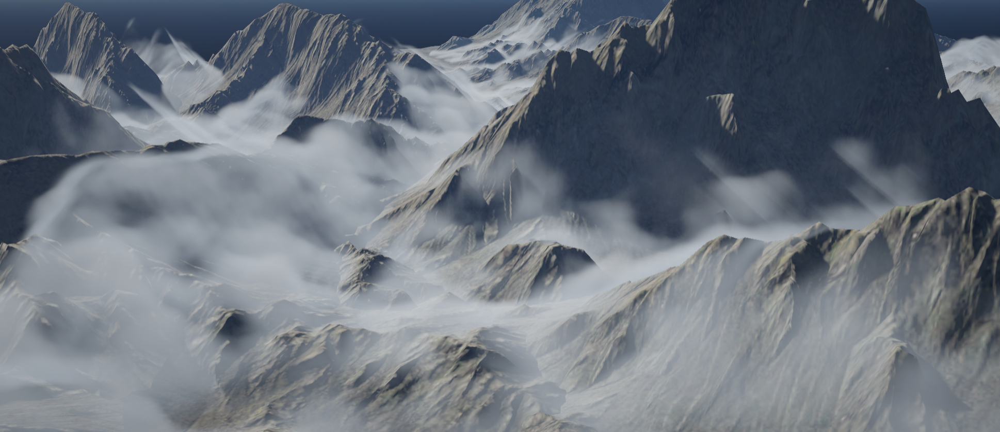

# Volumetric Fog for URP

### References
* [Gjoel16] [Low Complexity, High Fidelity: The Rendering of INSIDE, GDC 2016](Gjoel_Svendsen_Rendering_of_Inside.pdf)
* [Hillaire15] [Physically-based & Unified Volumetric Rendering in Frostbite, SIGGRAPH 2015](https://www.ea.com/frostbite/news/physically-based-unified-volumetric-rendering-in-frostbite)
* [Wronski14] [Volumetric Fog: Unified Compute Shader-Based Solution to Atmospheric Scattering, SIGGRAPH 2014](http://advances.realtimerendering.com/s2014/wronski/bwronski_volumetric_fog_siggraph2014.pdf)
* [Asher] [Create nice and feasible volumetric cloud in Unreal Engine 4](http://asher.gg/?p=2600)
