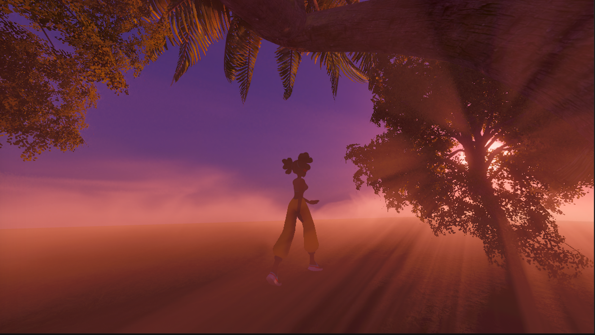

# Volumetric Fog for URP
A physically based volumetric fog rendering solution aimed at mobile platforms, featuring local volume, self-shadowing, phase functions, and more.

[Atmosphere Project](https://github.com/LvJunYu/AtmosphereScattering)

## Development Log

[Development Log](https://jojo-lyu.notion.site/Development-Log-Fog-436915344c7849c09fc44eefd7b4797b?pvs=4)
- [x]  Raymarching
- [x]  Spatial Filter
- [x]  Temporal Filter
- [x]  Box Integration
- [x]  Phase function
- [x]  Shadow Map Supported
- [x]  Density Map Supported (2D & 3D)
- [x]  Distortion - Curl Map
- [x]  Self-Shadow
- [x]  Height Map Supported
- [x]  Color Gradient

### References
* [Gjoel16] [Low Complexity, High Fidelity: The Rendering of INSIDE](https://www.gdcvault.com/play/1023002/Low-Complexity-High-Fidelity-INSIDE)
* [Hillaire15] [Physically-based & Unified Volumetric Rendering in Frostbite](https://www.ea.com/frostbite/news/physically-based-unified-volumetric-rendering-in-frostbite)
* [Wronski14] [Volumetric Fog: Unified Compute Shader-Based Solution to Atmospheric Scattering](http://advances.realtimerendering.com/s2014/wronski/bwronski_volumetric_fog_siggraph2014.pdf)
* [Asher] [Create nice and feasible volumetric cloud in Unreal Engine 4](http://asher.gg/?p=2600)
